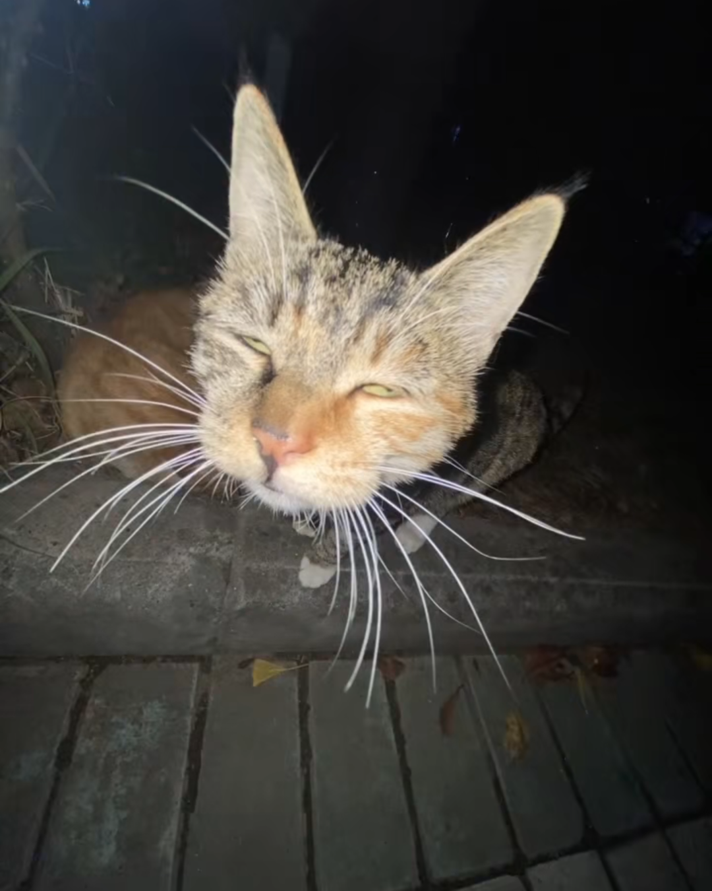

# 1. Ročník

# Úvod

- Tyhle materiály jsou **zcela** **zdarma** a jsou určené pro **studijní účely**
- dostupné **bez** aplikace či účtu Notion
- obsah se škáluje podle rozměry obrazovky, na **mobilních zařízeních se může obsah zobrazovat jinak**
- některé obrázky mohou být hůře viditelné při tmavém režimu
- zápisy mohou **obsahovat chyby**
- všechny zápisy a materiály, které jsem vytvořil, spadají pod licenci
- Předměty jsou rozdělené podle ročníků a maturita je separátně
- obor: **IT** od roku **2023 až 2026**

# Licence

## **CC BY-NC-SA**

---

# :flower2: [1. Ročník](1%20Ro%C4%8Dn%C3%ADk%20371306462a74809e94c1e0566d52675c.md)

[Český Jazyk 1. Ročník](1%20Ro%C4%8Dn%C3%ADk/%C4%8Cesk%C3%BD%20Jazyk%201%20Ro%C4%8Dn%C3%ADk%20371306462a748090b87dc8e813d57700.md) 

[Programování 1. ročník](1%20Ro%C4%8Dn%C3%ADk/Programov%C3%A1n%C3%AD%201%20ro%C4%8Dn%C3%ADk%203cd306462a7480e0bd7fcfa86a320c91.md) 

[Fyzika 1.ročník](1%20Ro%C4%8Dn%C3%ADk/Fyzika%201%20ro%C4%8Dn%C3%ADk%20371306462a7481f2b29df383d02afb35.md) 

[Základy Společenských Věd 1. ročník](1%20Ro%C4%8Dn%C3%ADk/Z%C3%A1klady%20Spole%C4%8Densk%C3%BDch%20V%C4%9Bd%201%20ro%C4%8Dn%C3%ADk%20371306462a7481cea2bbf0e62b4a61d0.md) 

[Operační systémy](1%20Ro%C4%8Dn%C3%ADk/Opera%C4%8Dn%C3%AD%20syst%C3%A9my%203cd306462a7480beb56ec43110874532.md) 

[Dějepis 1. ročník](1%20Ro%C4%8Dn%C3%ADk/D%C4%9Bjepis%201%20ro%C4%8Dn%C3%ADk%20399306462a7480a8bb68d5d8e92a5303.md) 

[Aplikační software 1. ročník](1%20Ro%C4%8Dn%C3%ADk/Aplika%C4%8Dn%C3%AD%20software%201%20ro%C4%8Dn%C3%ADk%203cc306462a748066b333cf987611f386.md) 

[Informační technologie 1. ročník](1%20Ro%C4%8Dn%C3%ADk/Informa%C4%8Dn%C3%AD%20technologie%201%20ro%C4%8Dn%C3%ADk%203cc306462a74805f9935e1f7942d03b6.md) 

[Hardware](4%20ro%C4%8Dn%C3%ADk/Hardware%20269306462a7480599f5ef9e8cd697f61.md) 

# :flower3: [2. ročník](2%20ro%C4%8Dn%C3%ADk%2010a306462a74802da953d7b4b3662def.md)

[Český jazyk 2. ročník](2%20ro%C4%8Dn%C3%ADk/%C4%8Cesk%C3%BD%20jazyk%202%20ro%C4%8Dn%C3%ADk%203b4306462a74807781fac8799a71b703.md) 

[Programování 2. a 3. ročník](3%20ro%C4%8Dn%C3%ADk/Programov%C3%A1n%C3%AD%202%20a%203%20ro%C4%8Dn%C3%ADk%203cd306462a7480f6af41dc5c7f4392a6.md) 

[Fyzika 2. ročník](2%20ro%C4%8Dn%C3%ADk/Fyzika%202%20ro%C4%8Dn%C3%ADk%2010a306462a7480daac00fd5443d0fed1.md) 

[Základy Společenských Věd 2. ročník](2%20ro%C4%8Dn%C3%ADk/Z%C3%A1klady%20Spole%C4%8Densk%C3%BDch%20V%C4%9Bd%202%20ro%C4%8Dn%C3%ADk%2043cdb5c622e6401481d1cfd856d289fb.md) 

[Operační systémy](1%20Ro%C4%8Dn%C3%ADk/Opera%C4%8Dn%C3%AD%20syst%C3%A9my%203cd306462a7480beb56ec43110874532.md) 

[Počítačové sítě 2. ročník](2%20ro%C4%8Dn%C3%ADk/Po%C4%8D%C3%ADta%C4%8Dov%C3%A9%20s%C3%ADt%C4%9B%202%20ro%C4%8Dn%C3%ADk%2010a306462a7480bbab53cf7326b1d26b.md) 

[Kybernetická bezpečnost 2. ročník](2%20ro%C4%8Dn%C3%ADk/Kybernetick%C3%A1%20bezpe%C4%8Dnost%202%20ro%C4%8Dn%C3%ADk%2010a306462a7480049944c4749faea11d.md) 

[Databáze](2%20ro%C4%8Dn%C3%ADk/Datab%C3%A1ze%202d1306462a74805480cef14bc7d02e47.md) 

# :flower4: [3. ročník](3%20ro%C4%8Dn%C3%ADk%20269306462a7480edb796f59c2f2b8958.md)

[Český jazyk 3. ročník](3%20ro%C4%8Dn%C3%ADk/%C4%8Cesk%C3%BD%20jazyk%203%20ro%C4%8Dn%C3%ADk%2013abd215cd5b4b599f20c2189604048c.md) 

[Programování 2. a 3. ročník](3%20ro%C4%8Dn%C3%ADk/Programov%C3%A1n%C3%AD%202%20a%203%20ro%C4%8Dn%C3%ADk%203cd306462a7480f6af41dc5c7f4392a6.md) 

[Fyzika 3. ročník](3%20ro%C4%8Dn%C3%ADk/Fyzika%203%20ro%C4%8Dn%C3%ADk%2007a2bdf2f22e4016b49bb4f84a9eaeae.md) 

[Ekonomika 3. ročník](3%20ro%C4%8Dn%C3%ADk/Ekonomika%203%20ro%C4%8Dn%C3%ADk%2066742173a68247398de6b75a9e57f530.md) 

[Operační systémy](1%20Ro%C4%8Dn%C3%ADk/Opera%C4%8Dn%C3%AD%20syst%C3%A9my%203cd306462a7480beb56ec43110874532.md) 

[Počítačové sítě 3. ročník](3%20ro%C4%8Dn%C3%ADk/Po%C4%8D%C3%ADta%C4%8Dov%C3%A9%20s%C3%ADt%C4%9B%203%20ro%C4%8Dn%C3%ADk%208cacd359515b40fb95f63746bc511e11.md) 

[Kybernetická bezpečnost 3. ročník](3%20ro%C4%8Dn%C3%ADk/Kybernetick%C3%A1%20bezpe%C4%8Dnost%203%20ro%C4%8Dn%C3%ADk%20f606b4501b4c4e72879736b18f9a4e53.md) 

[WWW programování 3. ročník](3%20ro%C4%8Dn%C3%ADk/WWW%20programov%C3%A1n%C3%AD%203%20ro%C4%8Dn%C3%ADk%20279c67790936411b8f7e7cb2f041289e.md) 

# :flower5: [4. ročník](4%20ro%C4%8Dn%C3%ADk%20399306462a74808d82e6cd5f909be9b5.md)

[Český jazyk 4. ročník](4%20ro%C4%8Dn%C3%ADk/%C4%8Cesk%C3%BD%20jazyk%204%20ro%C4%8Dn%C3%ADk%20269306462a74804e83faee1854175fe9.md) 

[Programování 4. ročník](4%20ro%C4%8Dn%C3%ADk/Programov%C3%A1n%C3%AD%204%20ro%C4%8Dn%C3%ADk%2032c306462a74803fbfb9f6eea245daa9.md) 

[Anglický Jazyk 4. ročník](4%20ro%C4%8Dn%C3%ADk/Anglick%C3%BD%20Jazyk%204%20ro%C4%8Dn%C3%ADk%2027d306462a7480d09cd9f0330fc1bd0f.md) 

[Svět práce 4. ročník](4%20ro%C4%8Dn%C3%ADk/Sv%C4%9Bt%20pr%C3%A1ce%204%20ro%C4%8Dn%C3%ADk%2028e306462a7480ea8591c0494f605f79.md) 

[Konzervace anglického jazyka 4. ročník](4%20ro%C4%8Dn%C3%ADk/Konzervace%20anglick%C3%A9ho%20jazyka%204%20ro%C4%8Dn%C3%ADk%20270306462a7480b597cbd751ea418c2a.md) 

[Počítačové sítě 4. ročník](4%20ro%C4%8Dn%C3%ADk/Po%C4%8D%C3%ADta%C4%8Dov%C3%A9%20s%C3%ADt%C4%9B%204%20ro%C4%8Dn%C3%ADk%20269306462a748006a461fa1e268da845.md) 

[Kybernetická bezpečnost 4. ročník](4%20ro%C4%8Dn%C3%ADk/Kybernetick%C3%A1%20bezpe%C4%8Dnost%204%20ro%C4%8Dn%C3%ADk%2026c306462a74809dac8bca6dc1aa4b3a.md) 

[WWW programování 4. ročník](4%20ro%C4%8Dn%C3%ADk/WWW%20programov%C3%A1n%C3%AD%204%20ro%C4%8Dn%C3%ADk%2026f306462a7480f88111e95851ed352c.md) 

[Hardware](4%20ro%C4%8Dn%C3%ADk/Hardware%20269306462a7480599f5ef9e8cd697f61.md) 

[Počítačová grafika 4. ročník](4%20ro%C4%8Dn%C3%ADk/Po%C4%8D%C3%ADta%C4%8Dov%C3%A1%20grafika%204%20ro%C4%8Dn%C3%ADk%20320306462a748033a00fe3865076103d.md) 

---

# Maturita

[Maturita HUB](Maturita%20HUB%20334306462a7480bf9555f77ae18bdc7e.md) 

---

# Předměty

[Český Jazyk 1. Ročník](1%20Ro%C4%8Dn%C3%ADk/%C4%8Cesk%C3%BD%20Jazyk%201%20Ro%C4%8Dn%C3%ADk%20371306462a748090b87dc8e813d57700.md)

[Fyzika 1.ročník](1%20Ro%C4%8Dn%C3%ADk/Fyzika%201%20ro%C4%8Dn%C3%ADk%20371306462a7481f2b29df383d02afb35.md)

[Základy Společenských Věd 1. ročník](1%20Ro%C4%8Dn%C3%ADk/Z%C3%A1klady%20Spole%C4%8Densk%C3%BDch%20V%C4%9Bd%201%20ro%C4%8Dn%C3%ADk%20371306462a7481cea2bbf0e62b4a61d0.md)

[Dějepis 1. ročník](1%20Ro%C4%8Dn%C3%ADk/D%C4%9Bjepis%201%20ro%C4%8Dn%C3%ADk%20399306462a7480a8bb68d5d8e92a5303.md)

[Aplikační software 1. ročník](1%20Ro%C4%8Dn%C3%ADk/Aplika%C4%8Dn%C3%AD%20software%201%20ro%C4%8Dn%C3%ADk%203cc306462a748066b333cf987611f386.md)

[Chemie](1%20Ro%C4%8Dn%C3%ADk/Chemie%203cc306462a748086921ad17c52aec54e.md)

[Základy Elektrotechniky](1%20Ro%C4%8Dn%C3%ADk/Z%C3%A1klady%20Elektrotechniky%203cc306462a74804d9886d340a5fb750d.md)

[Informační technologie 1. ročník](1%20Ro%C4%8Dn%C3%ADk/Informa%C4%8Dn%C3%AD%20technologie%201%20ro%C4%8Dn%C3%ADk%203cc306462a74805f9935e1f7942d03b6.md)

[Operační systémy](1%20Ro%C4%8Dn%C3%ADk/Opera%C4%8Dn%C3%AD%20syst%C3%A9my%203cd306462a7480beb56ec43110874532.md)

[Programování 1. ročník](1%20Ro%C4%8Dn%C3%ADk/Programov%C3%A1n%C3%AD%201%20ro%C4%8Dn%C3%ADk%203cd306462a7480e0bd7fcfa86a320c91.md)