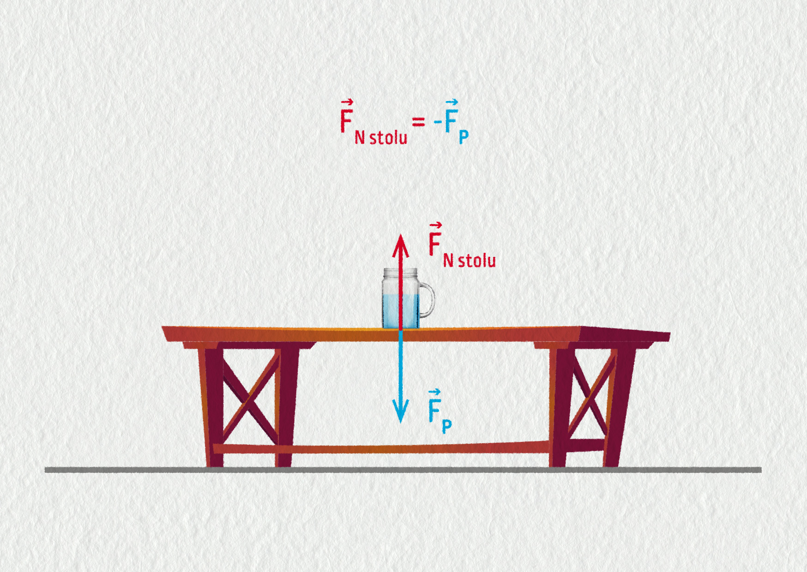
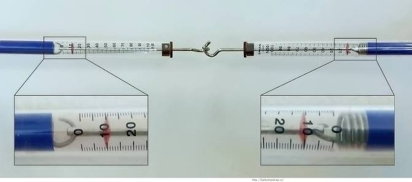

# Dynamika

- příčina pohybu a jeho změn
- za jakých podmínek nastává síla a jeho účinky na těleso
- síla se projevuje při vzájemném působení těles
- účinky síly jsou statické, dynamické, deformační
- jednotka je newton
- vektory znázorňujeme **úsečkou orientovanou** se šipkou $\longrightarrow \vec{F}$
- základem dynamiky jsou Newtonovy pohybové zákony

> **značka**... *F*
**Newton**... *N*
> 

# Newtonovy pohybové zákony

1. **setrvačnost**
2. **síla**
3. **akce a reakce**

## Zákon setrvačnosti

<aside>
📌

každé těleso setrvává v klidu nebo rovnoměrném přímočarém pohybu, dokud není přinuceno silovým působením jiného tělesa tento stav změnil.

</aside>

### Hybnost tělesa

- vyjadřuje pohybový stav tělesa
- značka = **p**
- $\bold{p = m \cdot v}$
- jednotka $[kg \cdot \frac{m}{s}]$
- vektor = $\vec{p}$
- $\bold{\vec{p} = m \cdot \vec{v}}$
- hybnost má stejný směr jako rychlost

### Příklad

$\large m = 800 \, kg$

$\large p = 18000 \, kg \cdot m/s$

$\Large v = ? \, [km/h]$

$\large p = m \cdot v$

$\large 18000 = 800 \cdot v$

$\large v = \frac{18000}{800}$

$\Large v = 22{,}5 \, m/s$

$\Large v = 81 \, km/h$

## Zákon síly

- základní veličiny $[a, F, m]$
- $\bold{a = \frac{F}{m} \Rightarrow F = m \cdot a}$
- zrychlení **a**
- síla **F**
- hmotnost **m**

> "Zrychlení $a$, které uděluje síla $F$ tělesem o hmotnosti $m$ je přímo úměrná velikosti síly $F$ a nepřímo úměrná hmotnosti $m$."
> 

> "1 newton je síla, která uděluje tělesu o hmotnosti 1 kilogramu udělí zrychlení $1 \, m/s^2$."
> 

$$
\Large F = m \cdot a
$$

$$
\Large 1N = 1 kg \cdot 1 \,\frac{m}{s^2} 
$$

$$
\bold{\Large N = kg \cdot m/s^2}
$$

### Kilová síla, tíha tělesa

$\large F = m \cdot a$

$\bold{\large F_G = m \cdot g}$

$\bold{\large G = m \cdot g}$

$\large F_G = G$

$\large G$ = gravitace
$\large g = 10 \, m/s^2$

### Příklady

$\large m = 75 \, kg$

$\large g = 10 \, m \cdot s^{-2}$

$\large F_g = ? \, [N]$

$\large F_G = g \cdot m$

$\large F_G = 10 \cdot 75$

$\large F_G = 750 \, N$

---

$\large F_1 = 60 \, N$

$\large a_1 = 0{,}8 \, m/s^2$

 $\large a_2 = 2 \, m/s^2$

$\large F_1 = 30 \, N$

$\Large F_2 = ? \, [N]$

$\large F_2 = 30 \cdot 5$

$\Large F_2 = 150 \, N$

---

$\large m = 200 \, kg$

$\large F = 50 \, N$

$\Large a=?[m \cdot s^{-2}]$

$\large a = \frac{F}{m}$

$\large a = \frac{50}{200}$

$\Large a = 0{,}25 \, m \cdot s^{-2}$

---

$\large m = 20000 \, kg$

$\large t = 10 \, s$

$\large s = 75 \, m$

$\Large F = ? \, [N]$

$\large F = m \cdot a$

$\large F = 20000 \cdot 1{,}5$

$\Large F = 30000 \, N$

$\large F=m \cdot a$

$\large s = \frac{1}{2}\cdot a\cdot t^2$

$\large 75 = \frac{1}{2}\cdot a\cdot 100$

$\Large a=1,5m/s^2$

---

$\large m = 200 \, g = 0{,}2 \, kg$

$\large t = 6 \, s$

$\large v = 3 \, m/s$

$\Large F = ? \, [N]$

$\large F = m \cdot g$

$\large a = \frac{v}{t}$

$\large a = \frac{3}{6}$

$\large F = 0{,}2 \cdot 0{,}5$

$\Large F = 0{,}1 \, N$

---

$\large m = 0{,}2 \, kg$

$\large F = 0{,}1 \, N$

$\large t = 6 \, s$

$\Large v = ? \, [m/s]$

$\Large s = ? \, [m]$

$\large v = a \cdot t$

$\large v = \frac{F}{m} \cdot t$

$\large v = \frac{0{,}1}{0{,}2} \cdot 6$

$\Large v = 3 \, m/s$

$\large s = \frac{1}{2} \cdot a \cdot t^2$

$\large s = \frac{1}{2} \cdot \frac{F}{m} \cdot t^2$

$\large s = \frac{1}{2} \cdot \frac{0{,}1}{0{,}2} \cdot 36$

$\Large s = 9 \, m$

---

$\large m = 200 \, g$

$\large F = 4 \, N$

$\large v = 1 \, m/s$

$\large t = ?[s]$

$\large v = a \cdot t$

$\large v = \frac{F}{m} \cdot t$

$\large v = \frac{4}{200} \cdot t$

$\Large t=0,05s$

$\large v = a \cdot t$

$\large v = \frac{F}{m} \cdot t$

$\large v = \frac{300}{600} \cdot 20$

$\Large v = 10 \, m/s$

---

$\large F = 20 \, N$

$\large t = 10 \, s$

$\large s = 25 \, m$

$\large v = 2{,}5 \, m/s$

$\Large m = ? \, [kg]$

$\large F = m \cdot a$

$\large F = \frac{F}{a}$

$\large F = \frac{20}{0{,}5}$

$\Large F = 40 \, kg$

$\large s = \frac{1}{2} \cdot a \cdot t^2$

$\large a = \frac{50}{100}$

$\Large a = 0{,}5 \, m/s^2$

## Akce a reakce

- 3. Newtonův zákon

"Každá dvě tělesa na sebe vzájemně působí stejně velkou silou o opačném směru (akce a reakce), souhrnně vznikají a zanikají."

## Impuls síly

$\large m = 200 \, g = 0{,}2 \, kg$

$\large F = 4 \, N$

$\large v = 1 \, m/s$

$\Large t = ? \, [s]$

$\large F = m \cdot a$

$\large F = m \cdot \frac{v}{t}$

$\Large F \cdot t = m \cdot v$ ⟹ hybnost tělesa

$\bold{\Large I = F \cdot t \, [N \cdot s]}$

$\large I = p$

$\Large p = m \cdot v \, [kg \cdot \frac{m}{s}]$

$\large I = p$

$\large NS = kg \cdot  \frac{m}{s}$

$\large kg \cdot \frac{m}{s^2}\cdot s= kg \cdot \frac{m}{s}$

$\large \frac{kg\cdot m}{s}=\frac{kg \cdot m}{s}$

### Příklady

$\large t = 60 \, s$

$\large v = 3 \, km/s = 3000 \, m/s$

$\large F = 150 \, kN$

$\Large m = ? \, [kg]$

$\Large s = ? \, [km/s^{-2}]$

$\large s = \frac{1}{2} \cdot a \cdot t^2$

$\large s = \frac{1}{2} \cdot \frac{3000}{60} \cdot 60^2$

$\Large s = 90000 \, m = 90 \, km$

$\large m = \frac{F}{a}$

$\Large m = 3000 \, kg$

---

$\large t = 90 \, s$

$\large v = 6 \, km/s = 6000 \, m/s$

$\large F = 320 \, kN = 320000 \, N$

$\Large m = ? \, [kg]$

$\large a = \frac{v}{t}$

$\large a = \frac{6000}{90}$

$\Large a = 66{,}6$

$\large m = \frac{F}{a}$

$\large m = \frac{320000}{66{,}6}$

$\Large m = 8000 \, kg$

---

$\large m = 500 \, t$

$\large F = 100 \, kN$

$\large t = 60 \, s$

$\Large v = ? \, [km/h]$

$\large F = m \cdot a$

$\large F = m \cdot \frac{v}{t}$

$\large F \cdot t = m \cdot v$

$\large v = \frac{F \cdot t}{m}$

$\Large v = \frac{100000 \cdot 60}{500000} = 12 \, km/h$