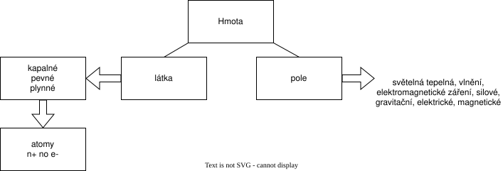

# Hmota

- látka a pole jsou 2 základní formy hmoty, které na sobě souvisí, jedna bez druhé nemůže existovat
- nezničitelná, pouze můžeme přeměnit (hoření)
- existuje v prostoru a čase
- je v neustálém pohybu

