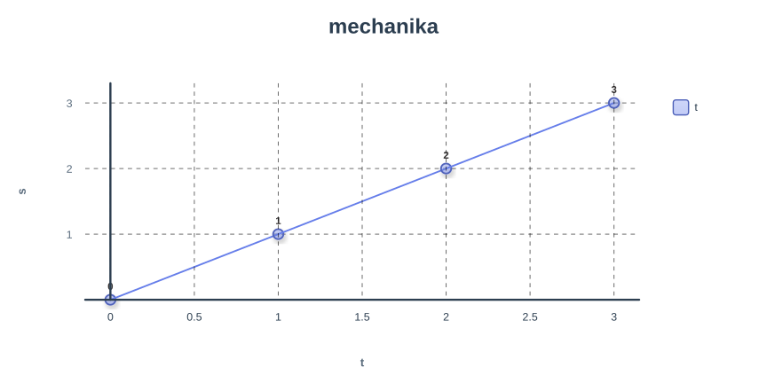

# Mechanika

<aside>
📌

zkoumá mechanický pohyb, jeho zákony a zákonitosti, pohyb popisuje a také hledá příčinu vzniku pohybu

</aside>

# Dělí se na

## **Kinematika**

- zkoumá pohyb těles, popisuje ho
- základní veličiny pro pohyb → rychlost, dráha, čas

## **Dynamika**

- zkoumá příčinu vzniku pohybu
- základní veličina a příčina vzniku pohybu je síla

> hmotný bod nahrazuje těleso
> 

# Vztažná soustava, trajektorie, dráha

## **Vztažná soustava**

- soustava těles, vzhledem k nimž vztahujeme klid a pohyb tělesa

## **Trajektorie**

- dráha kde se hmotný bod při mechanickém pohybu pohybuje
- geometrická čára, po které se hmotný bod pohybuje

## Dráha

- délka je trajektorie, kterou hmotný bod opíše za určitý čas
    - funkce času
    - základní jednotky (s, m)

- lineární závislost (přímá úměrnost)
- 1s ≙ 1cm
- 1m ≙ 1cm