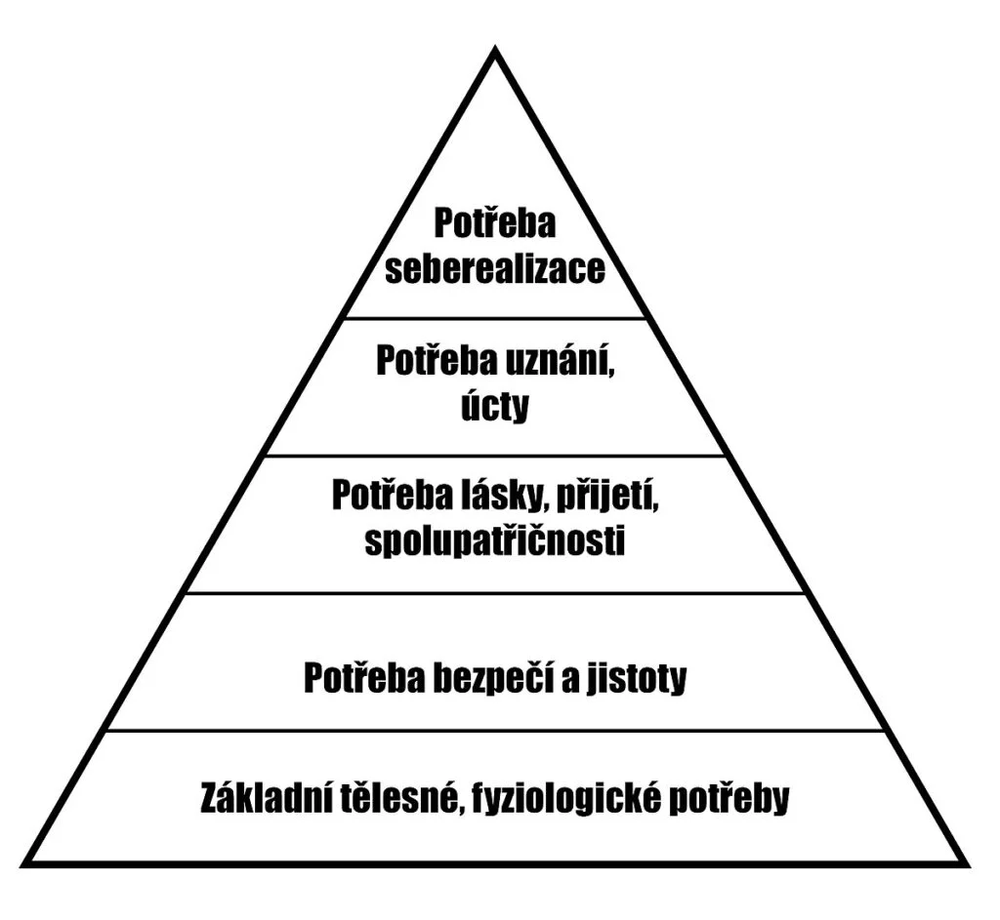

# Osobnost

# Psychické vlastnosti

- **temperament** (vrozená, dynamika prožívání a reakce, nálady jak jsou silné)
- charakter
- schopnosti
- motivy
- vlastnosti vůle

## Temperament

- vrozená, dynamika prožívání a reakce
- jak rychle, se střídají reakce, nálady, jak jsou silné

## Charakter

- soubor vlastností, které se projevují v chování, jednání
- projevují se ve vztahu k ostatním lidem, k práci, k sobě samému, k přírodě
- charakter se formuje v procesu výchovy a působením společnosti
- charakter je morální jádro naší osobnosti
- **Kladné:** citlivý, vytrvalý, věrný
- **Záporné:** jednoduchý, mlčenlivý, znechucený

<aside>
📌

**svědomí** = vnitřní hlas, systém naší osobní morální kontroly, povědomí o tom, co je dobré a špatné

</aside>

## Schopnosti

- vlastnosti, předpoklad pro úspěšné vykonávání dané činnosti (kvalita, rychlost, a jak rychle si je osvojíme)
- z části vrozené (anatomicko-fyziologické) dispozice

### Typy schopností

- **verbální:** chápání kontextu a vyjadřování
- **numerické:** operace číselnými symboly
- **prostorová představivost:** vizualizace (architektura)
- **paměťové:** krátko/dlouhodobá paměť
- **psychomotorické:** koordinace více současných pohybů
- **umělecké:** literatura, hudební tvůrce

### Stupně schopností

1. nadání (soubor, umožňuje nadprůměrné schopnosti...
2. talent (např. prostorové vidění)
3. genialita (rozvinutý talent, je vyvážený)

## Potřeby, motivy a postoje (jádro psychologie)

- **potřeba:** nedostatek (nadbytek něčeho) - nutí nás k činnosti
- máme nutnost potřeby uspokojit

### Abraham Maslow: pyramida potřeb

## Psychické procesy

- vnímání, představy, fantazie

> **vnímání:** co působí na naše smyslové orgány (zrak, sluch, hmat, pohybový analyzátor = vnímání polohy těla, kontrola pohybu)
**vjem:** akt vnímání
**počitek:** jedna část vjemu
**představy:** obraz něčeho/někoho, nepůsobí na nás
**fantazie (obrazotvornost):** používáme vjemy a paměťové procesy a rozvíjíme představy do snových neexistujících realit
> 

## Paměť a paměťové procesy

- proces, zapamatování, uchovat a znovu vybavit si informace
- rozlišujeme logickou/mechanickou paměť (krátkodobá/dlouhodobá)
- dochází k zapomínání

## Proces učení

- proces, kdy získáme vlastní dispozice, získávání/osvojování nových znalosti a zkušenosti
- záměrné × bezděčné

## Druhy učení

- **sociální:** učíme se žít mezi lidmi, sociální dovednosti (charakter, motivace)
- **senzomotorické:** smyslové a pohybové
- **vědomostní:** osvojování poznatků
- **intelektové:** řešení problémů

**Efektivita učení**

## Režim dne

> **Režim dne** časové rozvržení našich činností do 1 dne
> 
- **musí obsahovat**: práce, na osobní hygienu, odpočinek, jídlo...
- **fyzická aktivita:** tělesná činnost, úklid až po nejjednodušší pohybech v

#### odpočinek – aktivní

- sport – procházka – práce na zahradě – zájmy

#### Pasivní odpočinek:

- sledování TV – relax – odpočinek
- denní rytmus souvisí s biorytmem
- biorytmus nám klesá či stoupá během dne
- od 4:00–6:00 dobře funguje krátkodobá paměť
- od 17:00–21:00 druhý výkonnostní vrchol = dlouhodobá paměť

### Lidi se dělí

- **skřivan:** brzo vstává, brzy spát
- **sova:** pozdě stávající, nejaktivnější v odpoledne
- **holubi:** kombinují oba typy