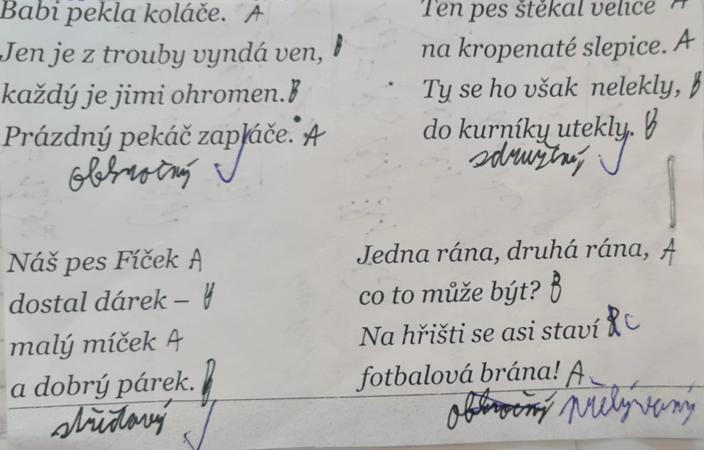

# Literatura

# Literární věda

## Literatura (littera)

> littera = písmo
> 
- soubor všech písemných textů

### Patří zde

- všechny texty zaznamenané na určitém místě, určitém historickém místě
- ústní lidová slovesnost = autor neznámý, šíří se ústním podáním (písně, pohádky, anekdoty)

## Funkce literatury

### Informativní

- odborná

### Formativní

- publicistický

### Estetická

- beletrie = všechny texty umělecké

### Výchovné

### Společenská

### Relaxační

## Rozdělení literatury podle funkcí

1. věcná = odborná, publicistická, administrativní
2. umělecká = estetická ⇒ beletrie
3. faktická = odborná estetická

# Literární věda (19. stol.)

- zkoumá literaturu
- částečně ústní lidová slovesnost (ÚLS)

## Disciplíny

### Literární teorie

- zákonitosti vzniku díla, kompozice díla, žánry, poetika

### Literární historie

- vývoj konkrétních literatur

#### pokouší se dílo od autora zařadit do

1. kontext autorovy tvorby
2. kontext regionální národní literatury
3. kontext vyšší celku v rámci literatury

### Literární kritika

- posuzuje a hodnotí aktuální lit. díla

# Literární forma

## Skládá se z

- **próza:** souvislý text v odstavcích (slova, věty, odstavce, kapitoly)
- **poezie:** verše, sloky (strofy)
- **drama:** repliky, scénické poznámky

## Poezie

- řeč vázaná
- zapamatovatelná (ve středověku kroniky, slovníky, učebnice, atd...)

### Struktura

- verš = jeden řádek
- sloka (strofa) = jeden myšlenkový celek, několik jednotlivých veršů
- rým → zvuková shoda na konci veršů

## Druhy rýmů

- sdružený AABB
- střídavý ABAB
- obkročný ABBA
- postupný ABC ABC
- přerývaný ABCB

## literární žánry

- útvar, které se realizují uvnitř literárních druhů

[Seznam literární žánrů.pdf](Literatura/Seznam_literrn_nr.pdf)

# Literární druhy

## Lyrika

<aside>
🚫

nemá děj (**nedějovost**)

</aside>

- zachycuje pocity, nálady, úvahy autora (lyrický subjekt)
- obrazové pojmenování = metafora
- **forma lyriky**: verš, sloky, rýmy

## Epika

<aside>
✅

**dějovost** = má děj, postavy

</aside>

- vyprávění = vypravěč = ich/er forma (1./3. osoba)
- nejčastěji v próze (věty, odstavce, kapitoly)

## Drama

<aside>
✅

má děj

</aside>

- jevištní zpracování (divadlo) = ztvárněná herci
- **repliky**: dialog X monolog
- veršovaná i psaná próza

## struktura divadelní hry

1. expozice (úvod)
2. kolize (zápletka)
3. krize (vyvrcholení)
4. perpetrie (obrat v ději)
5. katastrofa (závěr)