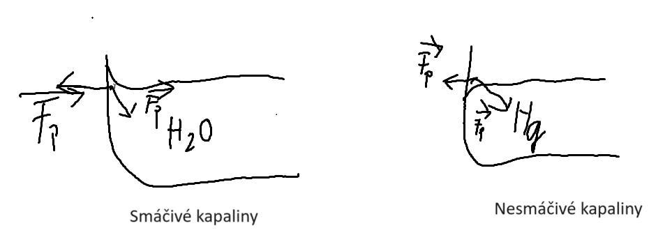

# kapaliny

- kapaliny představují jednu formu ze základní tří skupenství látek.
- kapaliny se skládají z molekul, které mají určitou charakteristickou vlastnost.
- molekuly u sebe leží poměrně blízko, avšak nejsou vázány v pevných polohách, mohou pohybovat dochází k přelévání kapaliny.
- kapalina nemá svůj vlastní tvar, udržuje tvar nádoby, ve které je nahromaděna, má svůj objem.
- kapaliny jsou náchylné na působení vnějších sil.

# vlastnosti

- nemají svůj tvar
- **volný povrch** - vodorovná hladina, u které lze pozorovat v místech styku s nádobou drobné zakřivení a to buď směrem nahoru nebo dolů dle konkrétních kapaliny
- tekutost, molekuly jsou nestále v pohybu (neuspořádaný a chotický)

## veličiny

1. Teplota:
- nejčastěji měříme teplotu, ta se měří teploměrem, ketrý je nutno ponořit do kapaliny a nechat ho tam

## Ne/Smáčivost kapalin

## Kapilární jev

Určeme hmotnost kapaliny, pokud známe hustotu p = 1000 kg/m3 a zároveň víme že vyplňuje celou nádobu tvaru krychle o hraně a=10cm