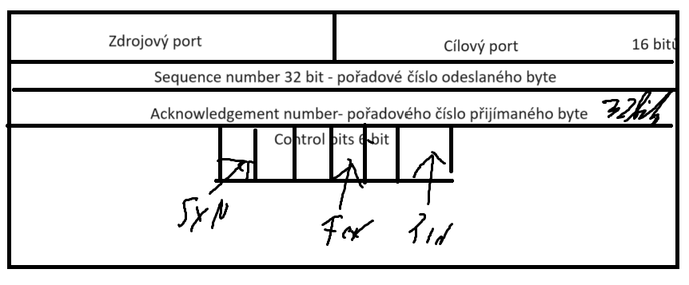

# TCP

- TCP rozděluje data do segmentů
- TCP oboustranné virtuální spojení
- je spolehlivé
- musí být přijmutí ve stejném pořadí jak bylo odesláno

# TCP header

- máme 65 000 portů

## Kontrolní bity:

1. **SYN** - synchronizace
2. **ACK** - přijmutí spojení
3. **FIN** - ukončení spojení
4. **ACK** - potvrzení (není acknowledgemnt number)
5. **URG** - urgentní point (nikdo neví)
6. **PHS** - push funkce (kdo ví co to je)
7. **RST** - reset

## navázání spojení:

> viz cisco 14.5.2
> 
- tří cestné podání ruky (tree-way handshake)
- full doplex (obou stranný spojení)

### Ukončení spojení:

- nastaví se příznak fin = 1

# flow control:

- window size
- ack bit
- **MTU**:
    - max. délka segmentu
    
    
    
- **Congestion Avoidance:**
    - vyhnutí se zahlcení
    - MSS
    - zmenšování a zvětšování okna