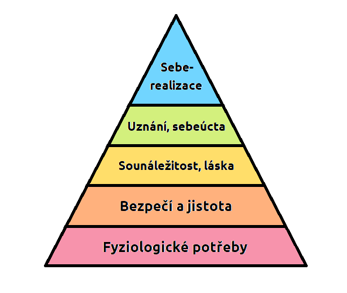

# Civilizace

## **Základní rysy**

- **Socializace**
    - Začlenění do skupiny
    - Proces v jehož průběhu se člověk jako biologický tvor stává prostřednictvím soc. kontaktů a komunikace s druhými
    - Člen určité skupiny
- **Kultura**
    - Duchovní a materiální rysy
    - Životní styl
    - Společná pravidla chování
    - Umění či pracovními nástroji
- **Specifikace**
    - Soustředění úsilí na soubor úkolů, každá osoba může použít na své schopnosti v společenském systému
- **Konkurence**
    - Soutěživost, odlišné zájmy různých subjektů

## Lidské potřeby

- pudy, potřeby, proto dělám co dělám
- pomáháme lidem, bo můžeme být ve stejné situaci někdy v budoucnu
- **Motiv:**
    - pohnutky či důvod něco udělat/neudělat
- **Motivace:**
    - motiv k určitému jednání
- **Potřeba:**
    - subjektivně pociťování nedostatek důležitého pro člověka
    - **biologické**: primární/vložené dýchání, spánek, potrava
    - **sociální**: získané
        - **kulturní:** vzdělání
        - **psychické**: radost, štěstí, láska

## Maslowa pyramida lidských potřeb

- Hierarchie potřeb, americký psycholog Abraham Harold Maslow
- 5 základních potřeb, seřazení podle postupu vyvinutí, smysl hodnoty
    - od nejnižších po nejvyšších
- uspokojení nižších potřeb, nastoupí vyšší potřeby

# Potřeby

> přirozená snaha udržet, rozvíjet a zlepšovat svůj život. dělá vše pro to aby dobrý život (stravování, obléká, vzdělávat se).
> 
- Potřeby jsou požadavky lidí, který se snažíme uspokojit, čímž zároveň odstraňuje vědomí jejich nedostatku
- pociťování nedostatek něčeho

## členění

- a)
    - hmotné - majetek
    - nehmotné - znalost, dovednost
- b)
    - inviduální - jednotlivec
    - společenské - ve skupině
- c)
    - současné - okamžitá situace
    - budoucí - do budoucna
- d)
    - zbytné - co potřebujeme
    - nezbytné - nepotřebujeme, ale chceme
- e)
    - hlavní - základní
    - doplňkové - doplňkové
    

## Uspokojování potřeb

> uspokojení pomocí prostředků statky a služby
> 
- různí lidé, různé potřeby, podle potřeby
- přizpůsobujeme i své chování

## Typy chování:

- **Sobecké chování:**
    - uspokojování svých potřeby bez ohledu na jiné
- **Prosociální:**
    - pomáhání ostatním i společnosti
    - vnímáno dobře
- **veřejný zájem chování:**
    - udržení či zvýšení životní  úroveň občanů
    - ve veřejné  politice
    - opak jako soukromý zájem nebo určité skupině
- **racionální chování:**
    - srovnává přínos a nákladů aby maximalizoval  svůj prospěch
- **Antisociální chování:**
    - distancování od lidi či určité skupiny

## Ovlivňování chování

- **morálka**
    - pro společnost je určitá představa o správném chování a jednání jedince
- **Právo**
    - systém pravidel, je vydána a vynutitelná státem
- **Tradice**
    - soubor vědění, zvyků a způsobu chování v rámci skupiny
    - z generace na generaci