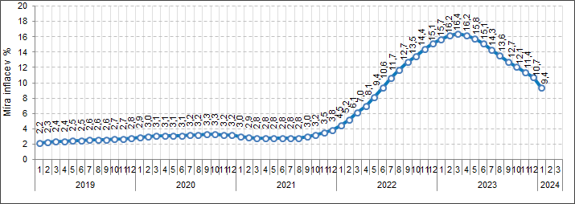

# Inflace

2025

- v roce 2020 vyrostly nejvíce ceny od 2012
- přírůstek indexu spotřebitelských cen 3,2%
- největší inflace za 8 let
    - 3. největší v EU
    - 1 a 2 místo patří Polsku(3,7%) a Maďarsku(3,4%)
- růst cen tabáku o 16,4%, poté lihoviny (5,4%), stravování (4,7%), nájem (2%), vodné (1,7%) a stočné (1,5%)

---

- zvyšování cenové hladiny zboží a služeb za dobu
- snížení kupní síly peněz
- změna cenové hladiny = míra inflace
    - poměr cenového indexu na konci a na začátku období
- index = spotřebitelské ceny, cen výrobců a deflátor HDP

## Cenová hladina

- úroveň cena výrobku a služeb, které se nakupují a prodávají

## Deflace

- opak inflace
- cenová hladina klesá

## Akcelerovaná inflace

- cenová hladina roste rychleji
- zvyšuje se míra inflace

## Desinflace

- inflace trvá
- cenová hladina roste pomaleji
- klesá míra inflace

# Typy inflace

## Podle původu

### Poptávková inflace

- poptávka > nabídka
- ceny jsou tlačeny nahoru, když je poptávka velká

### Nákladová inflace

- vyšší ceny vstupů do výroby (suroviny)
- ceny jdou nahoru vysokými náklady
- ⤴️ropa ⤴️ benzín

## Podle roční míry

### Plíživá inflace

- do 10%
- není nebezpečná, v míře

### Pádivá inflace

- desítky až stovky %
- velmi nebezpečná

### Hyperinflace

- v tisících %
- zhroucení peněžního systému, peníze již nemají význam (jenom nejsilnější přežiju :))

## Podle očekávaní

### Očekávaná (anticipovaná)

- soulad s očekáváním ekonomických subjektů

### Neočekávaná (neanticipovaná)

- nepředvídatelný průběh
- není rozdíl mezi skutečným a předpokládaným vývojem cen

# Ekonomické důsledky

- peníze ztrácejí hodnotu
- zvýhodněný dlužník a znevýhodněný věřitel
- slabší info funkce cen
- narušuje zahraniční obchod (kurzy cen)

# Výpočet inflace

- výpočet inflace = míra inflace v %

$$
(CH1-CH0)/CH0*100
$$

**CH1**= úroveň cenové hladiny tohoto období

**CH0**= úroveň cenové hladiny v předchozím období

# Výpočet cenových indexů

> index = cenová hladina
> 

## Index spotřebitelských cen (CPI)

- hodnota koše běžného roku / hodnota koše v ceně základního roku *100

$$
MI cpi = (CPI1-CPO0)/CPI0 *100
$$

## Deflátor

- HDP nominální / HPD reálný * 100

$$
(DEF1-DEF0)/DEF0 *100
$$