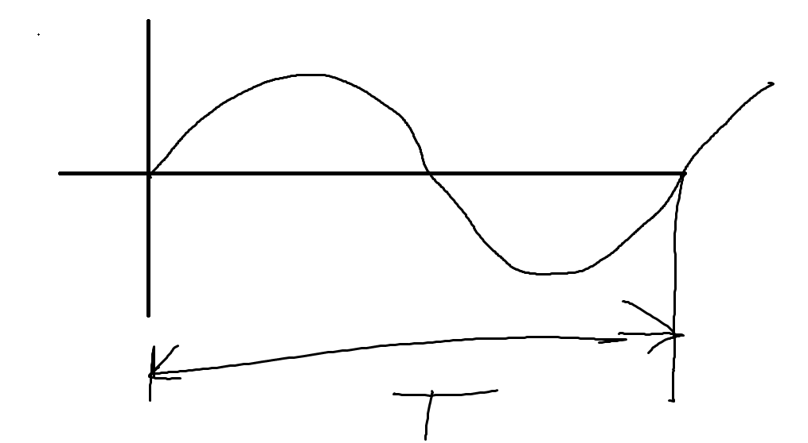

# Optika

<aside>
🔥

Nauka o světle

</aside>

# Zdroje světla

## přírodní

- oheň
- slunce
- fosfor
- světlušky
- tření minerálů

## umělé

- žárovka
- obrazovky
- laser

# Vlnová a kvantová povaha světla

$$
\Large λ = c\cdot T = \frac{c}{f}
$$

$$
\Large f = \frac{c}{λ}
$$

## fotony

> Světlo je elektromagnetické vlnění, jež přenáší energii nespojitě v kvantech nazvaných fotony.
> 

<aside>
💫

rychlost světla  c=300 000km/s ve vakuu

</aside>

# Optické prostředí

<aside>
🌫️

Vakuum

</aside>

- **Čirá prostředí** - Propouštějí světlo téměř úplně, nemění přitom jeho barvu (vzduch)
- **Průhledná prostředí** - propouštějí světlo částečně a pohlcují světlo některých vlnových délek (sklo)
- **Neprůhledné prostředí** - pohltí světlo úplně (kovy)
- **Průsvitná prostředí** - částečně pohlcují světlo (papír)

- Světlo se šíří ve stejnorodém prostředí přímočaře
- Rychlost světla závisí na prostředí
- Rychlost světla nezávisí na zdroji světla ani na jeho pohybu

<aside>
❗

index lomu n

</aside>

> Je určen poměrem rychlosti světla ve vakuu k rychlosti téhož světla v daném prostředí
> 

$$
\large n=\frac{c}v
$$

> index lomu vzduchu je jedna
> 

<aside>
🫠

index lomu charakterizuje pro dané prostředí

</aside>