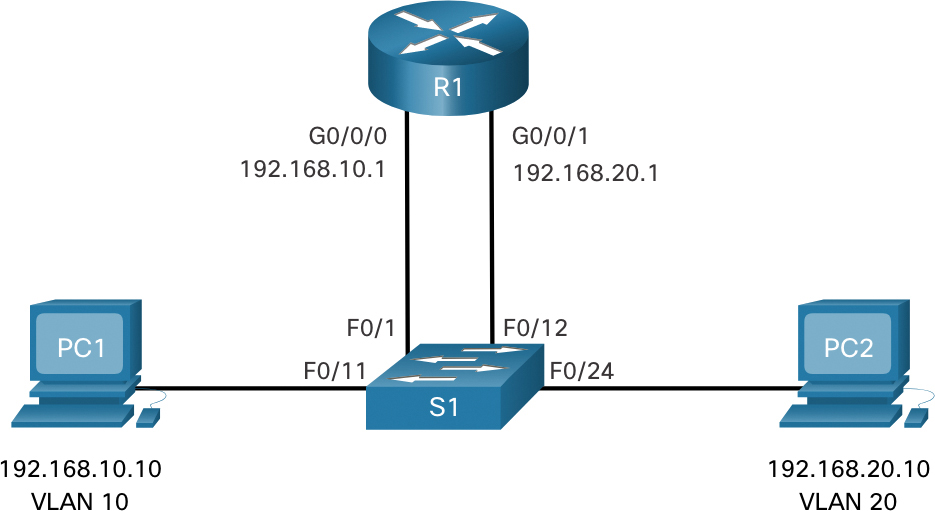

# Vlan

# Legacy/klasické



- pro každou VLAN je samostatná linka na router
- není používaný
- zastaralý způsob vlan inter routing
- velký trafic na routeru

# Router on stick


### konfigurace

```notion
S1(config)#int F0/5
S1(config-if)#switchport mode trunk
------------------------------------------------
S2(config)#int f0/18
S2(config-if)#switch-port mode access
S2(config-if)#switch-port access vlan 20
------------------------------------------------
R1(config)#int g0/0/1
R1(config-if)#no shut
R1(config-if)#int g0/0/1.10
R1(config-subif)#encapsulation dot 1Q **10**
R1(config-subif)#ip add 18.0.10.1 255.255.255.0
R1(config-subif)#int g0/0/1.20
R1(config-subif)#encapsulation dot 1Q **20**
R1(config-subif)#ip add 18.0.20.1 255.255.255.0
R1(config-subif)#int g0/0/1.30
R1(config-subif)#encapsulation dot 1Q 30
R1(config-subif)#ip add 18.0.30.1 255.255.255.0
```

### rámec

| preambule | src. MAC | des. MAC | TAG | lenght/type | packet | FCS |
| --- | --- | --- | --- | --- | --- | --- |
|  | 48 bit | 48 bit | 12 bit |  | vyšší vrstva |  |

TAG = číslo VLAN