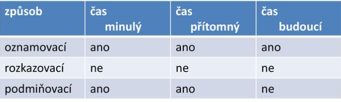

# Slovesa

- ohebná
- mluvnické kategorie
    - čas, osoba, číslo, způsob, rod, vid

# osoba

1. já, ty, on, ona, ono
2. my, vy, oni, ony, ona

# způsob

1. oznamovací, podmiňovací, rozkazovací

# čas

1. přítomný, minulý, budoucí

> z. **oznamovací** - tvoří všechny časy
z. **rozkazovací** - čas neurčuje
z. **podmiňovací** - tvoří čas přítomný a čas minulý
> 

# rod

1. trpný, činný

# vid

1. dokonavý, nedokonavý
- Vyjadřuje ohraničuje děj (už byl ukončen nebo ukončen bude)
    - Spisovatel dopsal knihu
- Vid dokonavý tedy, vyjadřuje děj, který bude ukončen a dosáhne tak nějakého cíle, kvůli kterému samotný děj začal.
- Mnemotechnická pomůcka
- plnovýznamová
- nesou význam
- větný člen
- přísudek
- infinitiv
- neurčitý - dělat spát