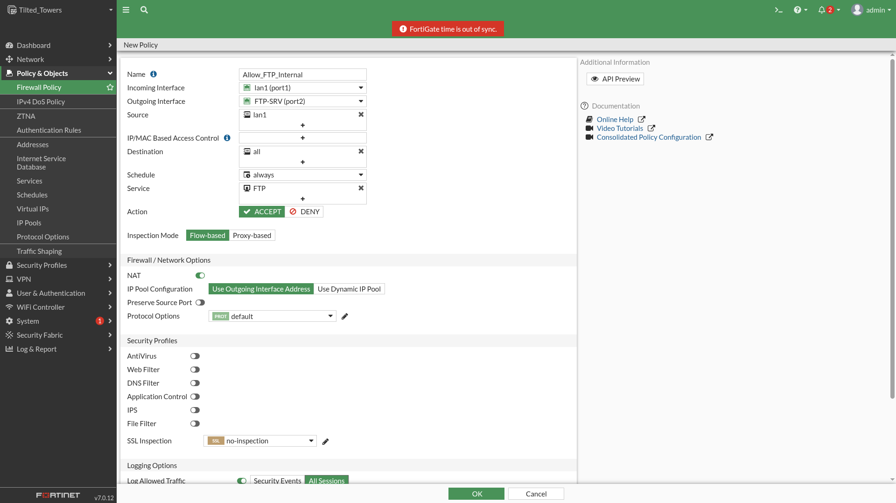

# Fortinet

# Zadání

### 1. **FTP pouze v rámci sítě 192.168.5.0/24**

1. Přihlaste se do FortiGate GUI.
2. Jděte na **Policy & Objects > IPv4 Policy**.
3. Klikněte na **Create New** a zadejte následující nastavení:
    - **Name**: Např. `Allow_FTP_Internal`.
    - **Incoming Interface**: Vyberte rozhraní, kde se nachází síť 192.168.5.0/24.
    - **Outgoing Interface**: Rozhraní směřující k cíli přenosu FTP.
    - **Source**: Klikněte na **Create New** a nastavte **Subnet** na `192.168.5.0/24`.
    - **Destination**: Nastavte **All**, pokud chcete povolit FTP kamkoli v rámci této sítě.
    - **Schedule**: Nastavte na **Always**.
    - **Service**: Vyberte **FTP**.
    - **Action**: **Accept**.
    - **Log Allowed Traffic**: Zapněte pro monitorování.
4. Klikněte na **OK**.

### 2. **DNS překlad pouze na zařízení s IP 192.168.10.10**

1. V **Policy & Objects > IPv4 Policy** klikněte na **Create New**.
2. Nastavte následující parametry:
    - **Name**: Např. `Allow_DNS_To_192.168.10.10`.
    - **Incoming Interface**: Rozhraní lokální sítě.
    - **Outgoing Interface**: Rozhraní směřující k zařízení s IP 192.168.10.10.
    - **Source**: Nastavte **All** nebo konkrétní síť, která potřebuje DNS překlad.
    - **Destination**: Zadejte IP **192.168.10.10** jako nový objekt (pokud není již vytvořen).
    - **Schedule**: **Always**.
    - **Service**: **DNS**.
    - **Action**: **Accept**.
3. Klikněte na **OK**.

### 3. **Blokace nešifrovaných poštovních protokolů (SMTP, POP3, IMAP)**

1. V **Policy & Objects > IPv4 Policy** klikněte na **Create New**.
2. Nastavte následující parametry:
    - **Name**: Např. `Block_Unencrypted_Email`.
    - **Incoming Interface**: Lokální síťové rozhraní.
    - **Outgoing Interface**: Internetové rozhraní (WAN).
    - **Source**: Lokální síť, kterou chcete omezit (např. 192.168.5.0/24).
    - **Destination**: **All** (pokud chcete blokovat tyto služby kamkoli).
    - **Schedule**: **Always**.
    - **Service**: Přidejte **SMTP**, **POP3** a **IMAP**.
    - **Action**: **Deny**.
3. Klikněte na **OK**.

### 4. **Blokace ping na server example.com v pondělí od 12:00 do 13:00**

1. Nejprve vytvořte časový plán:
    - Jděte na **Policy & Objects > Schedule** a klikněte na **Create New**.
    - **Name**: Např. `No_Ping_Monday_12-13`.
    - **Type**: **Recurring**.
    - Zvolte **Monday** a nastavte čas **12:00 - 13:00**.
    - Klikněte na **OK**.
2. V **Policy & Objects > IPv4 Policy** vytvořte nové pravidlo:
    - **Name**: Např. `Block_Ping_Example`.
    - **Incoming Interface**: Lokální síťové rozhraní.
    - **Outgoing Interface**: Internetové rozhraní (WAN).
    - **Source**: Lokální síť, odkud chcete ping blokovat.
    - **Destination**: Přidejte doménu nebo IP adresu **example.com** (pokud je známá) jako nový objekt.
    - **Schedule**: Vyberte dříve vytvořený časový plán `No_Ping_Monday_12-13`.
    - **Service**: **PING** nebo **ICMP**.
    - **Action**: **Deny**.
3. Klikněte na **OK**.

### 5. **Export konfigurace**

1. Přejděte do **System > Settings**.
2. Klikněte na **Backup**.
3. Zvolte možnost **Local PC** a pojmenujte soubor ve formátu `prijmeni_FGXX.conf` (např. `novak_FG99.conf`).
4. Uložte soubor na místní disk.

# 1. **FTP pouze v rámci sítě 192.168.5.0/24**

> **Policy & Objects → Firewall Policy**
> 

---

# 2. **DNS překlad pouze na zařízení s IP 192.168.10.10**

> **Policy & Objects → Firewall Policy**
> 

---

# **Blokace nešifrovaných poštovních protokolů (SMTP, POP3, IMAP)**

> **Policy & Objects → Firewall Policy**
> 

---

# **Blokace ping na server example.com v pondělí od 12:00 do 13:00**

> **Policy & Objects → Firewall Policy**
> 

---

# **Export konfigurace**

[Tilted_Towers_7-0_0523_202603190040.conf](Fortinet/Tilted_Towers_7-0_0523_202603190040.conf)