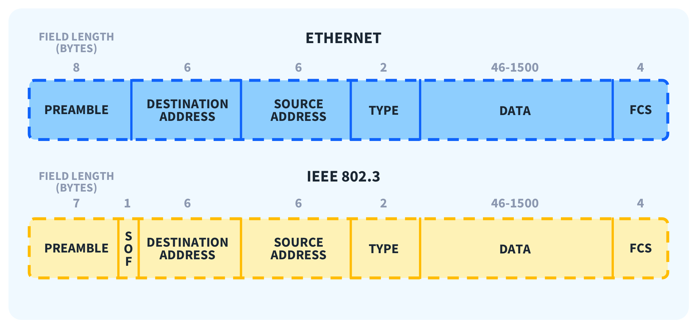

# 4. otázka VRSTVA SÍŤOVÉHO PŘÍSTUPU

---

- funkce fyzické vrstvy, reprezentace bitů na fyzické vrstvě, kódování
- charakteristika a porovnání jednotlivých přenosových médií, popis UTP/STP kabeláže
- funkce linkové vrstvy, principy a rozdělení Ethernetu
- popis datové jednotky na linkové vrstvě
- adresace na linkové vrstvě, ARP protokol

---

# funkce fyzické vrstvy, reprezentace bitů na fyzické vrstvě, kódování

- fyzická vrstva slouží pro změnu na příslušné médium
    - elektrický signál, světlo, rádiové frekvence
- poskytuje fyzické komponenty
    - média, konektory…
- dělá kódování signálu
- jednotlivé bity jako signál
- nejnižší vrstva ISO/OSI
- převod rámce na signál
- zajišťuje správné kódování, přístupové metody…
- označuje začátek a konec rámce


## Kódování 4B/5B

- rámec se rozděluje po 4B
    - převede se podle tabulky na 5B
- používá se pro správné časování/synchronizování
- tabulka zaručuje, aby v každém signálu byla jedna jednička
- detekce chyb


## Vyjádření bitů (signaling)

- bit má pouze určený čas na médiu (Bit time)

**Můžeme vyjádřit:**

1. amplitudu
2. frekvence
3. fáze


## Veličiny

<aside>
⚠️

bity za sekundu (bps)

</aside>

- vyjádření rychlost přenosu médiem

### Bandwidth

- přenosová rychlost

# charakteristika a porovnání jednotlivých přenosových médií, popis UTP/STP kabeláže

- vysílá odpovídající signál
- fyzické, elektrické a mechanické vlastnosti
    - typ média (UTP, STP…)
    - šířka pásma
    - typy konektorů
    - způsob zapojení konektorů - piny+barevné značení
    - maximální délky média

## Metalická média

- pro fyzické propojení mezi zařízeními
- levnější než optika
- nelze tak lehce přenášet zařízení, tak jako když se používá Wi-Fi
- **symetrické**
    - kabely UTP a STP - má kroucené páry
- **nesymetrické**
    - koaxiální kabely
    - má středový vodič a stínění

> **100BASE-T**
> 

100 - 100 mbps             BASE - technologie           T - twisted

## Minimalizace rušení

<aside>
💡

k minimalizaci rušení se používá kroucení vodičů a stínění kabelů

</aside>

- **kroucení** (twist) - kroucení, kvůli rušení jednotlivých vodičů
- **stínění** - fólie, jak jednotlivé tak i celý vodič může být stínění

## Bezdrátová média

- Bluetooth
    - krátká vzdálenost
    - Peer to Peer
- 802.11
    - verze (a, b, c…)
        
        
        
    - střední vzdálenost
    - pro domácnosti a firmy
- GPS
    - velká vzdálenost
    - mobilní zařízení

## UTP (Unshilded Twisted Pair)

- má 4 páry vodičů
- má konektor RJ45
- základní a nejlevnější

### Standardy

- **TIA/EIA-568A - TIA/EIA-568B**
- elektrické vlastnosti IEEE
    - podle kategorií
    - podle šířky pásma (cat5…)
    - cat5 - 100BASE-TX Fast Ethernet (přepínač)
    - Cat5e/6 je určená pro gigabit Ethernet

[https://encrypted-tbn0.gstatic.com/images?q=tbn:ANd9GcQKpneqPTKUVsUxo1NHVAMcyYu9WjxLMWvyxQ&s](https://encrypted-tbn0.gstatic.com/images?q=tbn:ANd9GcQKpneqPTKUVsUxo1NHVAMcyYu9WjxLMWvyxQ&s)

### Typy

<aside>
⚠️

dnes už není tak třeba, zařízení používají Auto-MDIX

</aside>

- **přímý** (Straight-through)
    - oba konce musí mít jeden standard A-A nebo B-B
    - slouží pro 2 různá zařízení
        - switch - PC
- **křížený** (Crossover)
    - každá konec má jiný standard A-B nebo B-A
    - pro propojení stejných zařízení
        - PC-PC

- **konzolový** (Rollover)
    - pro propojení RS232 s konzolovým portem na switch/router
    - pro blízkou správu zařízení
    - dnes už USB
    

| 1 | 8 |
| --- | --- |
| 2 | 7 |
| 3 | 6 |
| 4 | 5 |
| 5 | 4 |
| 6 | 3 |
| 7 | 2 |
| 8 | 1 |


koaxial

## STP (Shielded Twisted Pair)

- stínění kabelu
- stíní se jak celý kabel tak i jednotlivé páry
- pro 10Gb ethernet


## UTP kabely a jeho specifikace

Nestíněný kabel UTP je zdaleka nejoblíbenějším kabelem na světě.

**CAT1**

Běžně se používá pro **telefonní linky**. Tento typ kabelu není vhodný pro počítačové sítě a není kroucený. CAT1 je využíván telekomunikačními firmami pro služby **ISDN(Integrated Service Digital Network)** a **PSTN(Public Switch Telephone Network)**.

CAT2

Tento typ lze použít pro počítačové sítě i telefonní provoz. CAT2 je primárně využíván v sítích Token Ring a podporuje přenosovou rychlost až 4 Mbit/s.

**CAT3**

Stejný jako předchozí, ale s **rychlostí přenosu až 10 Mbit/s**. Postupně se začaly vodiče více kroutit. Vyšší specifikace znamená více zakroucené vodiče. Tento typ obsahuje čtyři páry kroucených vodičů a jeho maximální délka je 100 metrů. Byl používán v sítích **10Base-T Ethernet** a Token Ring.

CAT4

Má čtyři páry kroucených vodičů, ale maximální rychlost se zvýšila na 16 Mbit/s. Díky většímu počtu zákrutů na palec může dosahovat vyšší rychlosti. Maximální délka kabelu je 100 metrů. Používá se pouze v sítích Token Ring.

**CAT5**

Jako první dosahuje **rychlosti 100 Mbit/s** a má více zákrutů na palec než předchozí kabely. Používá se v sítích Ethernet, **FastEthernet** a Token Ring.

**CAT5E**

**Vodič má mírně vyšší výkon a umožňuje dosahovat rychlostí až 1 Gbit** pomocí technologie Full Duplex. Sítě typu Token Ring se již běžně nepoužívají. Kromě Ethernetu a FastEthernetu je k dispozici i GigabitEthernet. Tento druh je nejběžnější v bytech či firmách.

**CAT6**

Technologie Full Duplex umožnila využití tohoto kabelu na předchozí specifikaci Gigabitového Ethernetu. Kabel obsahuje plastový oddělovač propletených párů, což snižuje elektromagnetické rušení. Dokáže podporovat rychlost **1 Gbit** na vzdálenost **100 metrů** a až **10 Gbit** na vzdálenost do **55 metrů**. Vodiče v konektoru nejsou přesně vedle sebe, sudé od lichých mají malý odskok.

CAT6A

Představen v roce 2009 jako vyšší specifikace. Nabízí lepší imunizaci proti přeslechům a elektromagnetickému záření. Příliš se v praxi nepoužívá.

**CAT7**

**Specifikace CAT7 umožňuje přenos rychlosti 10 Gbit na 100 metrů.** Každý kabel zvlášť je stíněný, což chrání před přeslechy a rušením. Používá se v data centrech a pro páteřní propojení mezi servery a přepínači.

[Types of Ethernet Categories Explained | Versitron](https://www.versitron.com/pages/understanding-ethernet-category-types?srsltid=AfmBOoqp03FEKxLBHd-CxIU-eDajikI1raCB3kNl1oJE3Gj3fai89DaM)

# Optika

- skládají se z vlákna a obalu
- bity se přenášejí pomocí světelných impulzů
- nejsou rušena elektromagnetickým rušením
- lepší rychlost než metalické vedení
- mají menší útlum
- lepší přenosová vzdálenost
- jsou dražší než metalické vedení
- křehké vlákna
- použití pro páteřní vedení
- zdroj signálu může být LED nebo laser
- příjem skrz fotodiodu
    - převod světelného na elektrický impulz

### Složení


- **ochranný plášť (Jacket)**
    - fyzická ochrana kabelu
- **jádro (core)**
    - přenosové vlákno
- **plastový nárazník (armid yarn)**
- **opláštění jádra (buffer)**

## Single mode (Jednovidová)

- paprsek skrz jádro
- jádro 8 až 10 mikrometrů
- pro páteřní spoje
- jenom jeden paprsek jde skrz
- zdroj laserová dioda
    - 1310 až 1550 nm


## Multi mode (Mnohovidová)

- přenos několika světelných paprsků
- paprsky vstupují pod jiným úhlem do jádra
- každý paprsek dochází v rozdílný čas na konec spoje
    - dochází k roztažení impulzů (vidová disperze)
    - vid = paprsek
- zdroj led dioda
    - 850 nm
- jádro má průměr 50µm a víc
- má větší ztráty než single mode
    - použití k propojení budov do 2km
- levnější než single mode


# Bezdrátové technologie (Wi-Fi…)

> rádiové a mikrovlné frekvence
> 

- možnost mobilitu hostů
- není nutné žádné fyzické kabely
- menší náklady na vybudování sítě

- náchylnost na rušení od spotřebičů
    - mikrovlná trouba…
- lze zachytit přenos
- fyzické překážky snižují dosah sítě

### Wi-Fi (802.11)

- komerční použití
- AP (Access Point)
- CSMA/CA

### typy

**802.11a**
−2.4 GHz s rychlostí 2 Mbps
**802.11b**
−pracuje v pásmu 2,4 GHz s rychlostí 11 Mbps
−poskytuje lepší pokrytí a dosah v budově než standard 802.11a
**802.11g**
−pracuje v pásmu 2,4 GHz s rychlostí 54 Mbps

**802.11n**
−pracuje v pásmu 2,4 nebo 5 GHz s rychlostí 100 až 210 Mbps
−dosah až 70m


### BlueToooth (802.15)

- WPAN (Wireless Personal Area Network)
- 1 až 10 metrů


### WIMAX(802.16)

- multipoint technologie
- širokopásmové
- řešení poslední míle


### GSM (data)

- paketový přenos přes mobilní sítě
- 900 až 1800 MHz

---

# CSMA/CD (Carrier Sence Multiple Access / Collision Detection)

> detekce kolizí
> 
- detekuje kolize na médiu
1. když se detekuje kolize
2. všechny zařízení přestanou komunikovat
3. nastaví si nový náhodný čekací čas


---

# funkce linkové vrstvy, principy a rozdělení Ethernetu

- odpovídá za posílání přes sdílené médium
- umožňuje vyšší vrstvě přístup k médiu
- řídí vysílání a příjem dat
- detekce chyb u přenosu
- protokoly díky této vrstvě mohou být nezávislé na typu médiu
- řeší jak data posílat, co dělat při kolizi
- router má více rozhraní (interface), a mění podle typu média

### Potřebné informace

- **adresa** - komunikující uzly
- **časové** - začátek a konec komunikace
- **chybové** - checksum

## LLC (Logical Link Control)

- vyšší vrstva (síťová)
- softwarová část

## MAC (Media Access Control)

- adresace MAC
- příjem a vysílání signálu
- hardwarová část

# Ethernet

<aside>
⚠️

pracuje na fyzické a linkové vrstvě

</aside>


### Linková vrstva

- komunikuje přes LLC
- adresační schéma pro identifikaci zařízení
- organizace bitů do rámců
- MAC k identifikaci zařízení

### Fyzická vrstva

- nelze komunikovat s vyšší vrstvou
- nerozlišuje zařízení
- stará se pouze o posloupnost (0 a 1)



---

# popis datové jednotky na linkové vrstvě

# Rámec


- **Preamble (+SOF) (Preambule)**
    - synchronizace mezi uzly, detekce kolize
- **Destination MAC (cílová MAC)**
    - cílová MAC adresa adresáta
    - pokud MAC adresa je stejná se zařízením - předává se vyšší vrstvě
    - pokud MAC adresa není stejná se zařízením - posílá se pomocí MAC tabulky dále
- **Source MAC (zdrojová MAC)**
    - pro zaplňení MAC tabulky
    - MAC adresa odesílatele
- **Type/Lenght (typ/délka)**
    - pokud hodnota > 1536
        - je to označení vyšší vrstvy
    - pokud hodnota < 1500
        - jedná se o délku rámce nebo typ
- **Data**
    - min 46 bytů
    - max 1500 bytů (MTU)
        
        MTU (Maximum Transfer Unit)
        
- **Frame Check Sum (FCS)**
    - kontrola chyb
    - počítá se podle DESTINATION MAC + SOURCE MAC + TYPE/LENGHT  + DATA

---

# adresace na linkové vrstvě, ARP protokol

# MAC adresa

- hexadecimální 48 bitové číslo

> BA-5A-2E-C9-BF-B2
> 
- pro komunikaci v rámci lokální sítě
- MAC adresa neurčuje do jaké sítě patří (network portion)
- MAC adresy se mění při přechodu do jiných sítí
- Point To Point nepotřebuje konkretní fyzické adresy
    - používá se broadcast

## Struktura

- **2 části**
    - Organization Unique Identifier (OUI) (24 Bits)
    - přidělené výrobcem (24 Bits)
- 16,7  miliónů jedinečných adres pro 1 výrobce
- počet MAC adres
    - 281 474 976 710 656
- uplatnění v lokální síti


```jsx
ipconfig /all

1: lo: <LOOPBACK,UP,LOWER_UP> mtu 65536 qdisc noqueue state UNKNOWN group default qlen 1000
    link/loopback 00:00:00:00:00:00 brd 00:00:00:00:00:00
    inet 127.0.0.1/8 scope host lo
       valid_lft forever preferred_lft forever
    inet6 ::1/128 scope host 
 /      valid_lft forever preferred_lft forever
2: enp2s0: <NO-CARRIER,BROADCAST,MULTICAST,UP> mtu 1500 qdisc mq state DOWN group default qlen 1000
    link/ether e4:b9:7a:5e:cb:26 brd ff:ff:ff:ff:ff:ff
3: wlp1s0: <BROADCAST,MULTICAST,UP,LOWER_UP> mtu 1500 qdisc noqueue state UP group default qlen 1000
    link/ether 28:3a:4d:2a:93:fb brd ff:ff:ff:ff:ff:ff
    inet 10.70.1.52/20 brd 10.70.15.255 scope global dynamic noprefixroute wlp1s0
```

## Unicast (str. 15)

- pouze pro jedno zařízení (UNI)

### Postup ARP

1. zařízení odešle ARP dotaz (broadcast)
    - ptá se na MAC adresu příjemce
2. všechny zařízení přijmou tento dotaz
    - pouze jedno zařízení by mělo odpovědět se svou IP adresou


# Broadcast MAC

- v části pro zařízení musí být samé jedničky pro IPv4
    - 192.168.21.255
- v destination MAC jsou samé jedničky
    - FF-FF-FF-FF-FF-FF

# Multicast

- skupina zařízení, která má příjmout rámce


# CSMA/CD (Carrier Sense Multiple Access / Collision Detection)

- vznik na koaxiálním kabelu
- sdílené médium (BUS)


## Kolizní domény

- HUBy
    - fungují na fyzické vrstvě
- když 2 zařízení začnou posílat v jeden okamžik, dojde ke kolizi dat

### Bit time

> potřebný čas k odeslání dat z NICu (Network Interface Card)
> 

10 Mbit/s

# Switch

- předat rámec, z příchozího portu na správný odchozí port

## Store forward

- switch příjme rámec a celý rámec si uloží do bufferu (vyrovnávací paměť)
- po zkontrolování checksumu odešle na správný odchozí port
    - pokud to není checksum nevychází, tak se rámec zahodí


## Fast-forward

- switch jakmile načte destination MAC adresu
- začne posílat rámec na odchozí port

.png)

## Fáze SWITCHe

- switch má MAC address table
    - je ze začátku prázdná

1. learning
2. aging
3. flooding
4. selective forwarding
5. filtering

- když není záznam v tabulce
    - source MAC adresu si uloží do tabulky s příchozím portem
        - fáze učení (learning)
    - pošle rámec na všechny porty, krom příchozího (flooding)
- po naučení sítě
    - switch dělá selective forwarding
    - odesílá podle MAC ADDRESS tabulky na správný port switche (e.g. g0/1)
        - fáze selective forvarding
    - záznam má životnost 300 sekund defaultně
        - pokud se záznam nepoužije, smaže se po čase
        - fáze stárnutí (aging)
- switch si ukládá rámce do paměti (buffer)
    - zkontroluje se CRC (kontrolní součet)
    - fáze filtrace (filtering)
    
    <aside>
    ⚠️
    
    Switch musí být v módu Store-and-Forward
    
    </aside>
    

```jsx
SW1#show mac address-table
-------------------------------------------.
Vlan    Mac Address       Type        Ports
----    -----------       --------    -----
All    0011.9297.ef00    STATIC      CPU
All    0011.9297.ef01    STATIC      CPU
All    0011.9297.ef02    STATIC      CPU
...
```

### Tabulka

| port | MAC ADDRESS |
| --- | --- |
| 1 | 0A-F3-23-45-67-AB |
| 2 | 47:2a:f7:69:b2:af |
| 3 | fd:d2:71:6c:a6:a2 |

# ARP protokol

- mapování IP na MAC adresy
- udržuje ARP tabulku aktuální
    - ARP cache v RAM paměti
- překlad IP na MAC adresu

### Postup

1. rozešle se ARP broadcast
    1. každé zařízení obdrží broadcast
    2. zařízení, které má dotazovanou MAC adresu, by mělo odpověďet
    3. zařízení odešle zpět ARP response

> FF:FF:FF:FF:FF:FF
> 

### Udržování obsahu ARP tabulky

> vytvářená dynamicky za běhu zařízení
> 
- monitorováním provozu
- pomocí ARP dotazu
- každý záznam má svou omezenou dobu platnosti
- užití


@Anonymous 

## Proxy ARP

- pro odesílání ARP do jiných sítích
- router musí být Proxy ARP
- pro všechny záznamy zařízení z jiných sítích má jako výchozí bránu
- router se vydává za odesílatele ARP dotazu


```jsx
arp -a
| output |
V        V
```


## Stárnutí záznamů

- každý záznam má omezenou dobu platnosti
- pokud není záznam použit do určitého času, tak se záznam smaže
- pokud se záznam použije, prodlouží se jeho platnost
- existují **statické** záznamy, které nemají životnost
    - lze je jen odstranit manuálně

## problémy ARP

- zatěžuje linku
    - velký počet PC v sítí může zpomalit výkon sítě
- bezpečnost
    - ARP spoofing
    - ARP poisoning